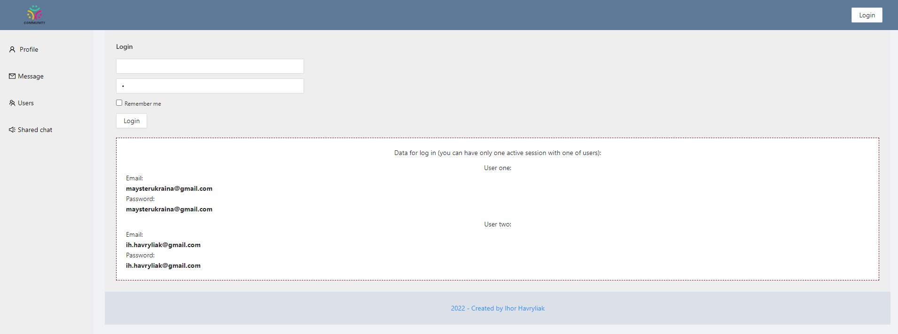
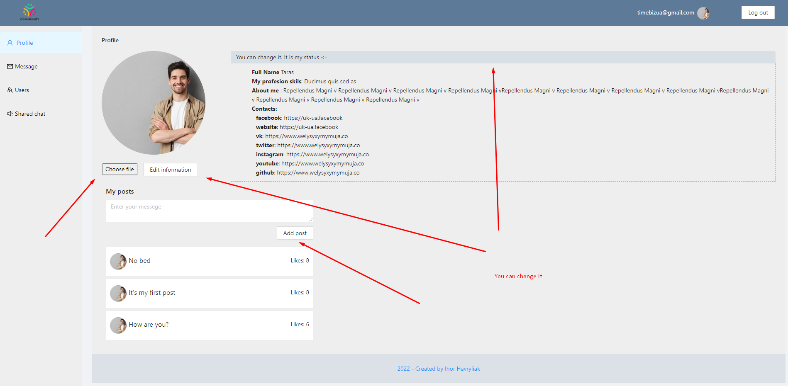
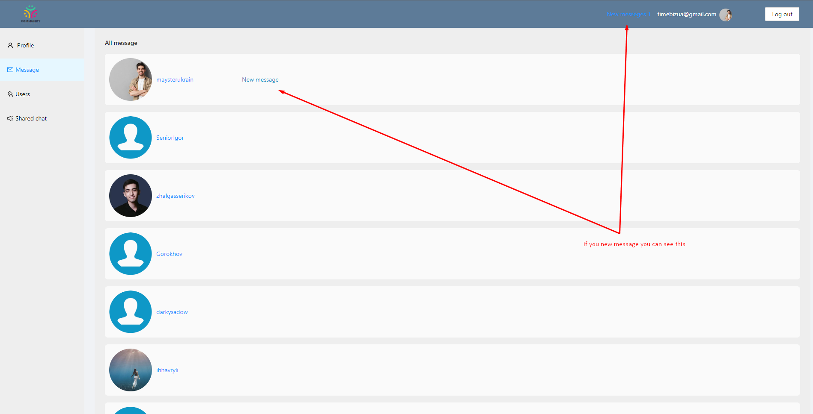
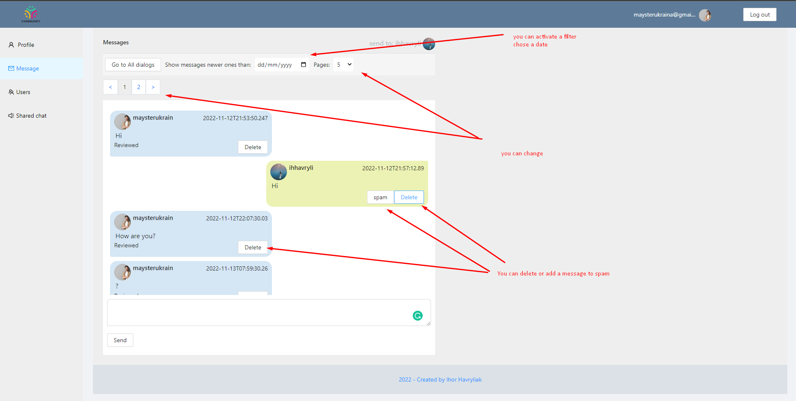
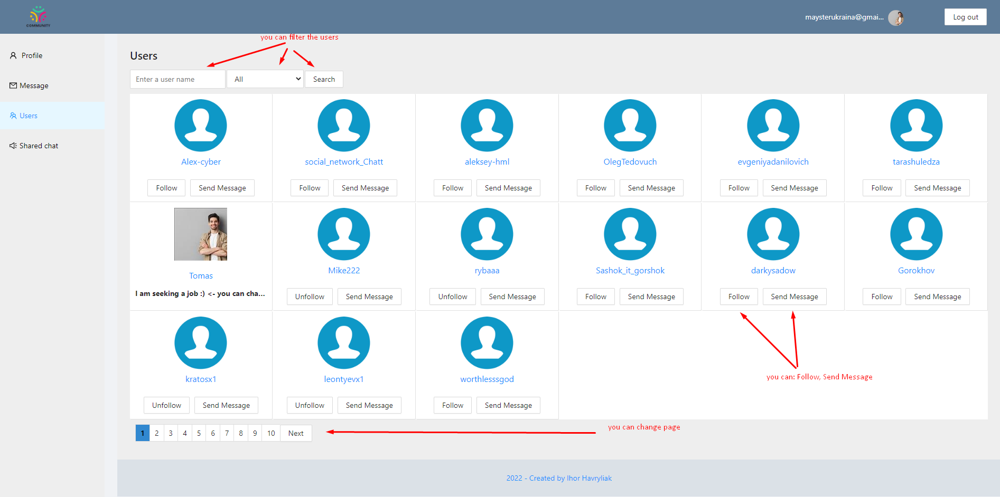
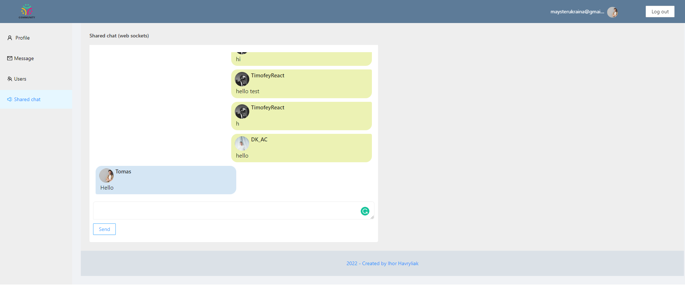

# Getting Started with Social Network App

Link for this project [Social Network App](https://ihorhavryliak.github.io/reaxt-social-netwoeking/#/login).

## Pages
### `Login`
### `Profile`
### `Dialogs`
### `Users`
### `Chat (web sockets)`

-----
### `Login`

Open [Login](https://ihorhavryliak.github.io/reaxt-social-netwoeking/#/login) to view it in your browser.
Log in.

### `Profile`

See the  [Profile](https://ihorhavryliak.github.io/reaxt-social-netwoeking/#/profile) for more information.

### `Dialogs`

See All message the  [Dialogs](https://ihorhavryliak.github.io/reaxt-social-netwoeking/#/dialogs) for more information.

Message

### `Users`
See the page [Users](https://ihorhavryliak.github.io/reaxt-social-netwoeking/#/users) for more information.

### `Chat (web sockets)`

See the page [Users](https://ihorhavryliak.github.io/reaxt-social-netwoeking/#/chat) for more information.

